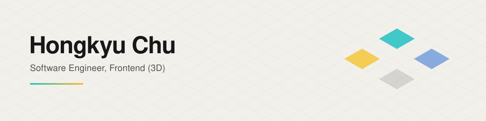
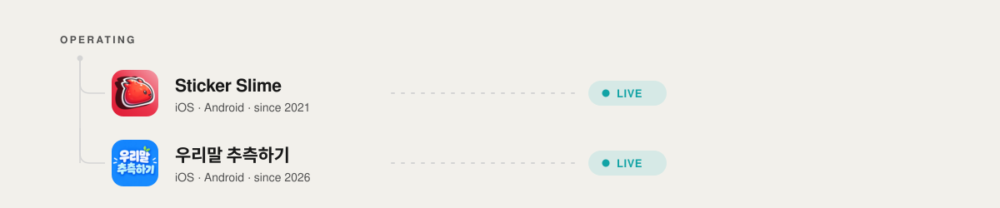

<picture>
  <source media="(prefers-color-scheme: dark)" srcset="./assets/header-dark.svg">
  
</picture>

A frontend developer who keeps looking for ways to improve the user experience.
Mostly working with 3D on the web.

**[Portfolio](https://www.mrchu.art)** · **[Resume](https://www.mrchu.art/resume)** · chuhongkyu@gmail.com

---

<picture>
  <source media="(prefers-color-scheme: dark)" srcset="./assets/operating-dark.svg">
  
</picture>

Two mobile games I build and run on my own.

- **Sticker Slime** — [IOS](https://apps.apple.com/kr/app/sticker-slime/id6670695864) · [Android](https://play.google.com/store/apps/details?id=com.Mr.chu.StickerSlime)
- **우리말 추측하기** — [IOS](https://apps.apple.com/kr/app/id6816624571) · Android

---

## Experience

| Company | Period |
|---|---|
| **Karrot (당근마켓)** | 2025.09 ~ 2026.09 |
| **Ailive** | 2024.09 ~ 2025.09 |
| **DOES Interactive** | 2022.08 ~ 2023.11 |
| **Mapo-gu Office** | 2022.03 ~ 2022.08 |

## Teaching

**[Building Interactive 3D Web, Easily and Efficiently](https://fastcampus.co.kr/dev_online_3dinteractive)** — FastCampus, 2023.10 ~

From implementation to optimization, with R3F and Three.js.

- [Part 2 — Weather API](https://mr-chu-weather.netlify.app/)
- [Part 3 — Car Direction Keys](https://mr-chu-car-web.netlify.app/)

## Selected Work

| Project | Notes |
|---|---|
| [Genaimo](https://genaimo.ailive.world/) | Generative-AI motion SaaS. A pipeline that turns AI motion data into animation clips, a real-time 3D scene editor on Three.js, and character retargeting with both automatic and manual paths. |
| [당근이네](https://www.daangn.com/kr/group/%EB%8B%B9%EA%B7%BC%EC%9D%B4%EB%84%A4-%EC%9C%A0%EC%A0%80-%EB%AA%A8%EC%97%AC%EB%9D%BC-1d9k92dxan78/) | Karrot |
| [Mario: Life of a Developer](https://mario-dev-life.vercel.app/) | Three.js |
| [Driving Practice Game](https://car-drive-practice.vercel.app/) | Next.js + R3F |

---

The SVGs above are baked by <a href="./script/build-svg.mjs"><code>script/build-svg.mjs</code></a>. Their colors come from the <a href="https://github.com/chuhongkyu/Mr_chu_HomePage/blob/main/tokens/color.json">DTCG tokens</a> of the portfolio, so changing the site palette carries over here.
